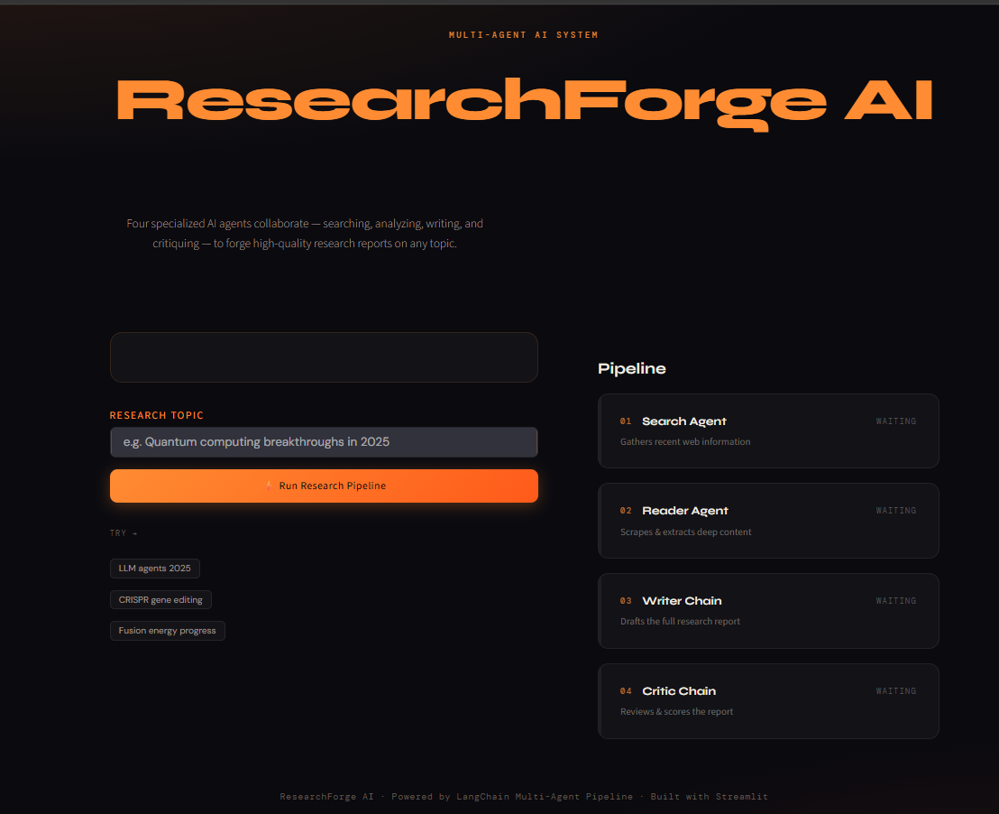

# ResearchForge AI 🔬

### Autonomous Multi-Agent AI Research Assistant

ResearchForge AI is an autonomous **multi-agent research system** built with **LangChain and Mistral AI** that automates the complete research workflow — from research planning and information discovery to report generation and quality evaluation.

The system uses specialized AI agents to search reliable sources, extract relevant information, generate structured research reports, and review the final output for accuracy and completeness.

---

## 🚀 Features

- 🤖 Multi-Agent AI Architecture
- 🧠 Automated Research Planning
- 🔎 Real-Time Web Research using Tavily API
- 📄 Intelligent Web Content Extraction
- ✍️ AI-Generated Research Reports
- 🧐 Automated Report Evaluation
- 🌐 Interactive Streamlit Interface
- 📥 Downloadable Research Reports

---

## 🏗️ Architecture

```text
                User Query
                    |
                    ↓
            Planner Agent
                    |
                    ↓
            Search Agent
                    |
                    ↓
          Tavily Web Search
                    |
                    ↓
            Reader Agent
                    |
                    ↓
      Web Content Extraction
                    |
                    ↓
            Writer Agent
                    |
                    ↓
      Research Report Generation
                    |
                    ↓
            Critic Agent
                    |
                    ↓
         Quality Evaluation
```

---

## 🤖 AI Agent Workflow

### Planner Agent

Creates a research strategy by breaking the topic into meaningful sections and defining the research direction.

### Search Agent

Finds relevant and reliable information from the web using Tavily Search API.

### Reader Agent

Extracts and cleans useful information from webpages using web scraping techniques.

### Writer Agent

Generates structured research reports using Mistral AI with a professional research format.

### Critic Agent

Reviews the generated report for accuracy, completeness, source reliability, and quality.

---

## 🖥️ Application Preview

<p align="center">
  
</p>

---

## 🛠️ Tech Stack

### AI / LLM
- LangChain
- Mistral AI

### Agent Framework
- LangChain Agents

### Web Intelligence
- Tavily Search API
- BeautifulSoup
- Requests

### Frontend
- Streamlit

### Language
- Python

---

## 📂 Project Structure

```text
ResearchForge-AI/
│
├── app.py              # Streamlit application
├── agent.py            # AI agents and LLM chains
├── tools.py            # Search and scraping tools
├── pipeline.py         # Research workflow pipeline
│
├── assets/
│   └── researchforge-ui.png
│
├── requirements.txt
├── README.md
└── .env.example
```

---

## ⚙️ Installation

### Clone Repository

```bash
git clone https://github.com/yourusername/ResearchForge-AI.git
```

### Install Dependencies

```bash
pip install -r requirements.txt
```

---

## 🔑 Environment Variables

Create a `.env` file:

```env
MISTRAL_API_KEY=your_mistral_api_key
TAVILY_API_KEY=your_tavily_api_key
```

---

## ▶️ Run Application

```bash
streamlit run app.py
```

---

## 📄 Output

ResearchForge AI generates structured research reports containing:

- Executive Summary
- Introduction
- Background
- Key Findings
- Analysis
- Challenges
- Future Scope
- References

---

## 👨‍💻 Author

**Arun Kushwah**

B.Tech Information Technology

---

## 📄 License

This project is licensed under the MIT License.

